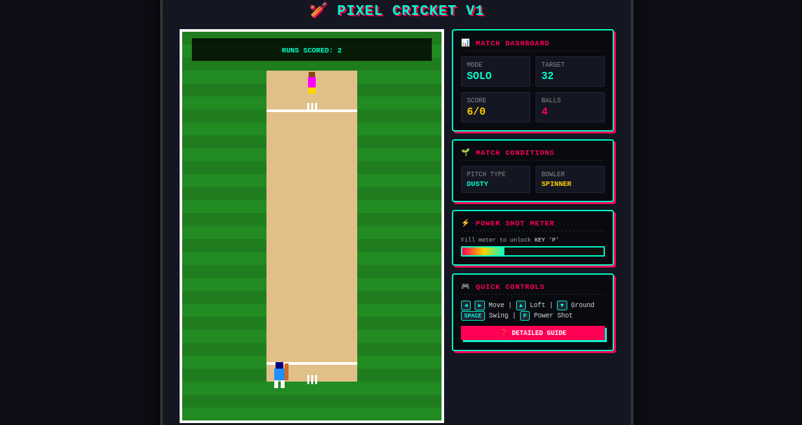
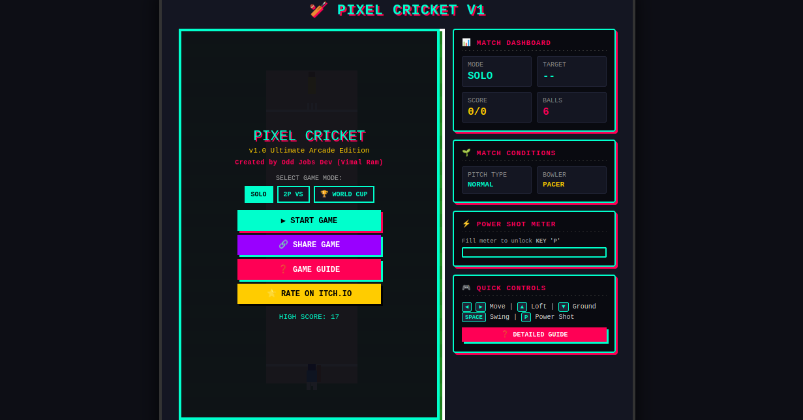

# 🏏 Pixel Cricket v1 - Ultimate Arcade Edition

[](https://opensource.org/licenses/MIT)
[](https://developer.mozilla.org/en-US/docs/Web/JavaScript)
[](https://github.com/Vimal9RAM-NAP/pixel-cricket)

A fast-paced, retro-styled browser cricket game built with HTML5 Canvas and Vanilla JavaScript. Features interactive bowling mechanics, customizable match modes, dynamic pitch types, synthesized retro audio, and full touch/keyboard controls.

---

## 📸 Gameplay & Interface

|                    🎮 Gameplay View                     |                  ⚙️ Main Menu                   |
| :-----------------------------------------------------: | :---------------------------------------------: |
|  |  |

---

## ✨ Key Features

- **Multiple Game Modes:**
  - **SOLO:** Quick play against randomized target scores.
  - **2P VS:** Local turn-based match setup.
  - **🏆 WORLD CUP:** Tournament-style play mode.
- **Dynamic Pitch & Bowling Conditions:**
  - **Pitch Types:** Dusty, Green, Hard, and Dry variations with distinct pitch colorings.
  - **Bowler Styles:** Fast, Swing, Medium Pace, and Spinner styles altering ball speed and trajectory.
- **Special Shots & Match Overlays:**
  - Ground Shots, Lofted Sixers, and an automatic **Power Shot** meter triggered at 100%.
  - Arcade-style **Match Victory** and **Match Defeat** overlays directly rendered over the pitch canvas.
- **Pure Web Technologies:**
  - **Zero Dependencies:** Single-file HTML/JS execution—no npm install or build step required.
  - **Web Audio API:** Built-in retro sound synthesis for hits, misses, and match wins/losses.
  - **Responsive Canvas:** Full support for desktop keyboard layout and mobile touch/drag controls.

---

## 🎮 Controls Overview

| Action               | Desktop Keyboard             | Mobile / Touch Screen           |
| :------------------- | :--------------------------- | :------------------------------ |
| **Move Batsman**     | `Left Arrow` / `Right Arrow` | Drag left or right on the pitch |
| **Swing Bat**        | `Spacebar`                   | Tap pitch canvas                |
| **Loft Shot Mode**   | `Up Arrow`                   | Tap `▲ LOFT` button             |
| **Ground Shot Mode** | `Down Arrow`                 | Tap `▼ GROUND` button           |
| **Power Shot**       | Auto-triggers at 100% Meter  | Auto-triggers at 100% Meter     |

---

## 🚀 How to Run

```bash
# 1. Clone the repository
git clone [https://github.com/Vimal9RAM-NAP/pixel-cricket.git](https://github.com/Vimal9RAM-NAP/pixel-cricket.git)

# 2. Navigate into the directory
cd pixel-cricket

# 3. Open in browser (or open index.html directly / use VS Code Live Server)
code .
📁 Repository Structure
pixel-cricket/
├── docs/
│   └── screenshots/
│       ├── gameplay.png       # Gameplay screenshot
│       └── menu.png           # Main menu screenshot
├── index.html                 # Main game code (Canvas, CSS, JS)
├── LICENSE                    # MIT License
└── README.md                  # Project Documentation
🛠️ Built With

    HTML5 Canvas — 2D graphics rendering and animation loop

    Vanilla JavaScript (ES6+) — Game logic, collision detection, and physics

    Web Audio API — Real-time retro sound effect synthesis

    CSS3 — Custom retro arcade UI layout

📄 License

Distributed under the MIT License. See LICENSE for more information.
```
